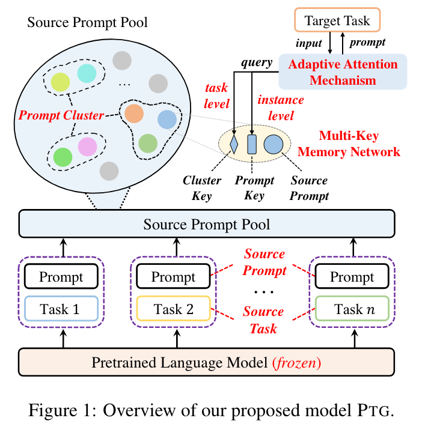

 2022-10-21 
*title*:
[Learning to Transfer Prompts for Text Generation,NAACL 2022](https://github.com/RUCAIBox/Transfer-Prompts-for-Text-Generation)

*Authers*: 
Junyi Li, Wayne Xin Zhao

*institute*: 
Gaoling School of Artificial Intelligence, Renmin University of China, Beijing Key Laboratory of Big Data Management and Analysis Methods

*Topic*: 
Transfer Learning, Text Generation, Prompt Learning 

*Motivation*: 
真实场景中数据往往是有限的，大量工作关注于利用prompt进行迁移学习。然后，当前在文本生成的迁移学习存在两个问题，其一， prompt是任务高度相关的，很难高校地迁移或者重用到新的任务上；其二，一个学习好的prompt未必适用于所有的样本。本文提出一种新的迁移学习范式。

*Details*: 
作者的应用背景是文本生成，即有T个生成任务作为源任务，学习特定任务的prompt。对于每一个任务，固定transformer，只调节prompt参数，可以获得一个特定任务的prompt。这里的prompt是若干可学习的向量，模型输入是prompt+text，输出是目标文本。

整个过程如下：
1. 将学习到的prompt进行聚类，希望建模源任务之间的相似性。具体地，每一个prompt被看作一个节点，利用spectral聚类算法将源prompt聚成多个类别。
2. 为了将训练好的prompt迁移到目标任务，作者建立了一个多key记忆网络。对于每一个特定的prompt，有两个可学习的key，cluster key来定位cluster，prompt key定位prompt。
3. 之前的工作只考虑了任务信息而没有考虑样本信息。但是，一个特定任务的prompt可能并不适用于所有样本。对于目标任务，作者同时使用任务级别的信息和样本级别的信息来选择合适的prompt，任务级别信息和样本级别信息均由参数固定的BERT得到。
4. 最终通过加权求和的方式确定prompt参数。

*Experiments*：
1.作者将14个数据集分成3类生成任务，分别是压缩（例如摘要任务），转导（文本风格转化）和创新（例如对话）。作者对跨数据集和跨任务都进行了实验，较为充分。
2. 在跨任务的迁移方面，摘要生产和个性对话都达到了不错的效果。在所有基线中，prefix-tuning仅次于本文方法，因此可以多考虑这种prompt学习方式。

*Comments*:
本文考虑了在多任务上prompt新的组合方式，同时考虑到了文本的相似性和prompt的相似性。

 2022-10-17 

*title*:
[Single-dataset Experts for Multi-dataset Question Answering, EMNLP2022](https://github.com/princeton-nlp/MADE)

*Authers*: 
Dan Friedman, Ben Dodge, Danqi Chen

*institute*: 
Department of Computer Science, Princeton, NJ

*Topic*: 
Question Answering, Adapter 

*Motivation*: 
 阅读理解的数据集很多，作者从以下两点出发：（1）如何使模型在所有数据集上都表现较优？
 （2）如何使模型更好地泛化到新的数据集上？作者提出利用特定数据集的adapter，这些adapter共享相同的transformer，在迁移过程利用这些adapter的参数，从而实现更优的性能。

*Details*: 
1. 作者把模型分为三类参数，共享的transformers，特定数据集的分类器和特定数据集的adapter。因为作者假定所有数据集都是span任务，所以这里特定数据集的分类器是token-level classifiers。
2. 训练过程：两阶段训练。第一阶段是联合优化，即对所有数据集训练所有的参数。第二阶段是微调，即模型在验证准确率不再提升后，继续在每个数据集上进行微调adapter参数和token-level classifiers参数。
3. 针对零样本的泛化能力，作者直接平均已有的所有adapter参数和所有分类器参数，以分别作为新领域的adapter和分类器。作者也尝试了将所有分类器的预测结果进行概率平均，但是结果与前者平均上述参数的性能近似。
4. 针对少样本的迁移学习，新数据集的adapter 参数（分类器参数）通过已有adapter参数（分类器参数）平均进行初始化。这里有两种权值学习 方式。方式一：通过微调transformer，新adapter和新分类器。方式二：先联合学习transformer，所有的adapter和分类器，然后对adapter参数和分类器参数取平均，再在新数据集上进行微调。

*Experiments*：
1.模型采用roberta-base，只增加了1%左右的参数。源领域数据集有6个，目标领域数据有6个。
2.作者在零样本和少样本场景下都进行了实验，

*Comments*:
参数平均即可用在新领域，主要是因为新领域和元领域都是阅读理解，任务跨度不大。对于零样本的迁移，可以考虑探究更有效的参数结合方式。

---
 2022-10-16 

*title*:
[SPACE-2: Tree-Structured Semi-Supervised Contrastive Pre-training for Task-Oriented Dialog Understanding, COLING 2022](https://github.com/AlibabaResearch/DAMO-ConvAI/tree/main/space-2)

*Authers*: 
Wanwei He, Yongbin Li

*institute*: 
Shenzhen Institute of Advanced Technology, Chinese Academy of Sciences, China; DAMO Academy, Alibaba Group

*Topic*: 
Task-oriented Dialogue, Semi-Supervised Learning, Contrastive Learning 

*Motivation*: 
已有的对比学习方法只将自身样本进行数据增强后作为证正样本，其他所有样本当作负样本，这导致语义相近的样本们具有不一样的表示。本文通过引入语义树信息，来衡量不同样本之间的相似。

*Details*: 
1. 数据集：带标注对话数据集AnPreDial和无标注对话数据集UnPreDial。
2. 带标注对话数据集：首先获得每一个样本的语义树。这里的语义树是层级的，例如domain，intent，slot和value。并根据标签不同，将语义树分为10类，即可理解为每一个样本根据其label可以构建10个标签，每个标签都是一个集合。利用**杰卡德系数**衡量两个子标签之间的相似度。这里计算loss时使用该相似度进行加权。
3. 对于无标注对话数据集，直接通过数据增强作为正样本，其他样本作为负样本。

*Experiments*：
1.使用四个任务作为评测任务，分别是意图预测（分类任务），槽识别（序列标注），语义解析（前两个任务的联合），对话状态追踪（提取span任务）
2. 模型初始化使用ConvBERT。

*Comments*:
衡量样本相似度进行加权的方式可以考虑在其他场景中应用。

---
